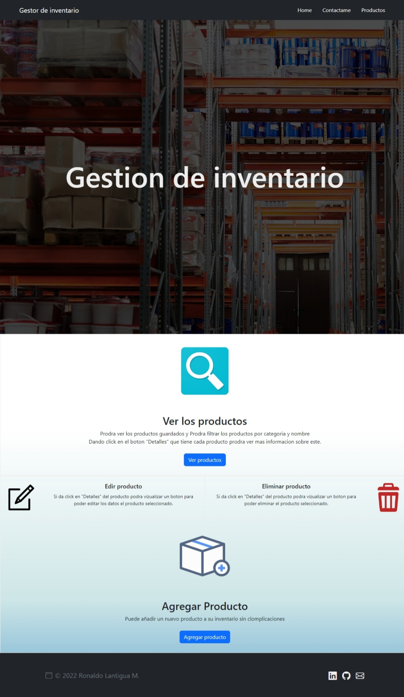
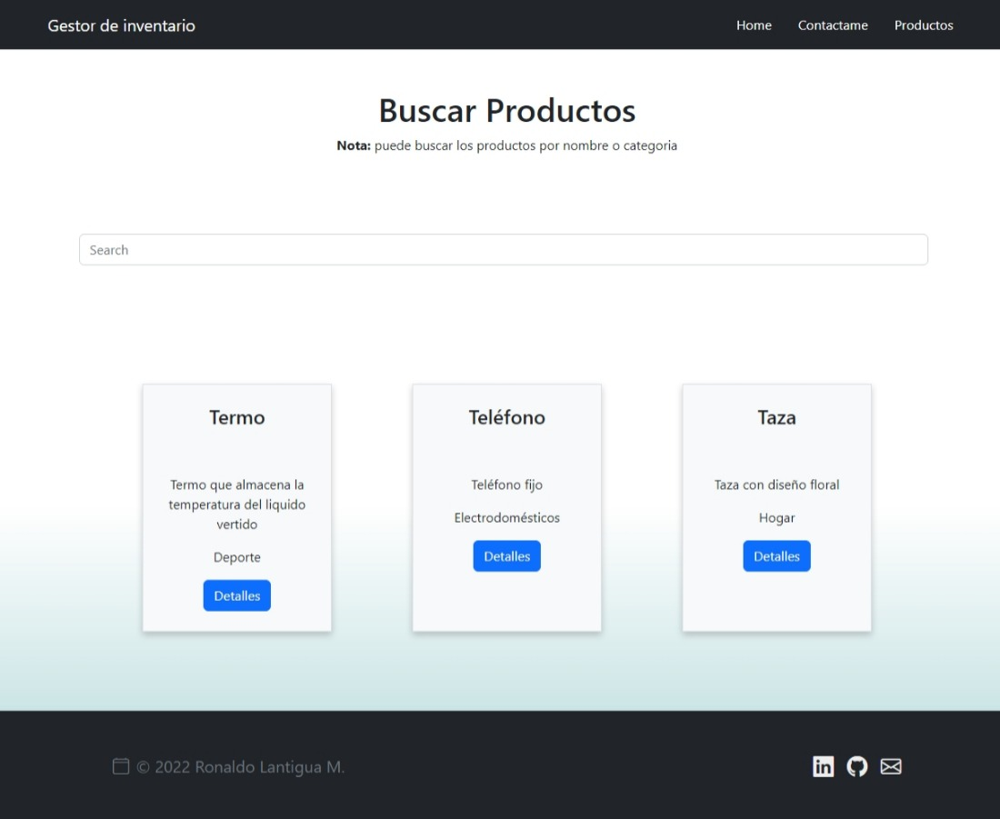
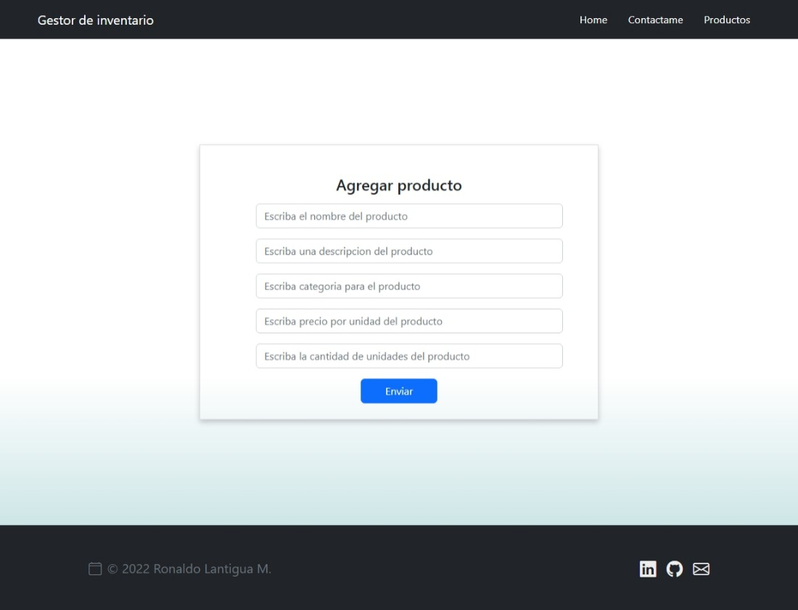
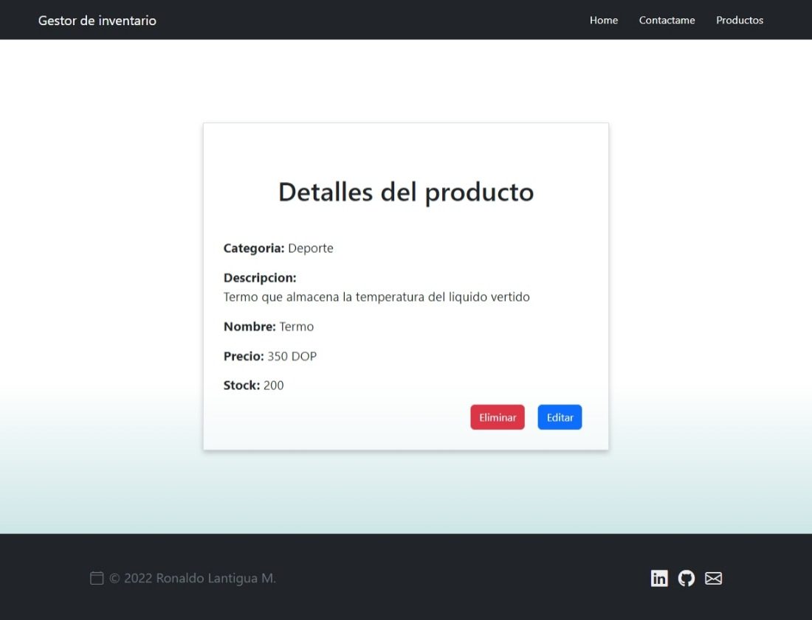
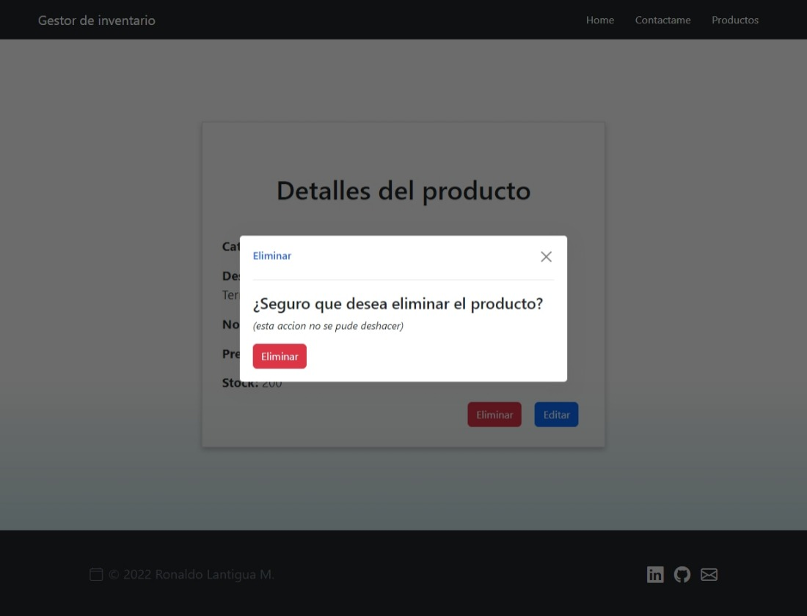
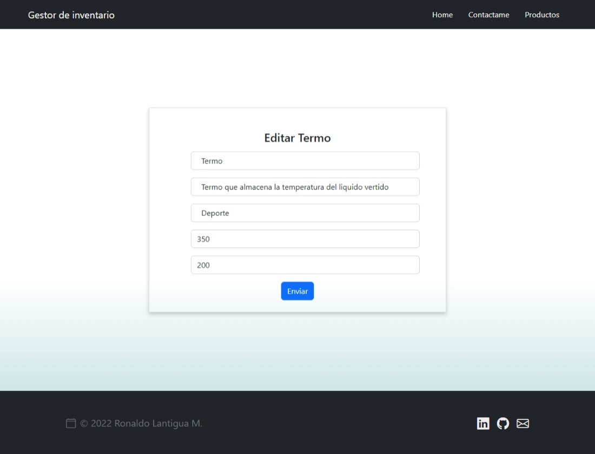
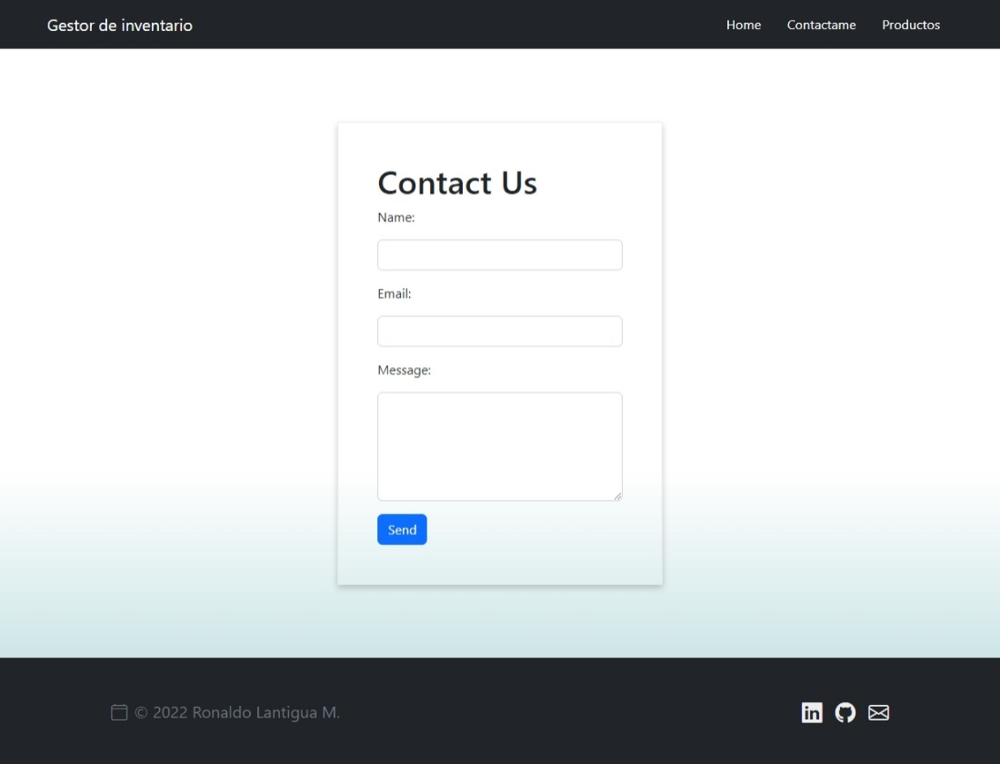
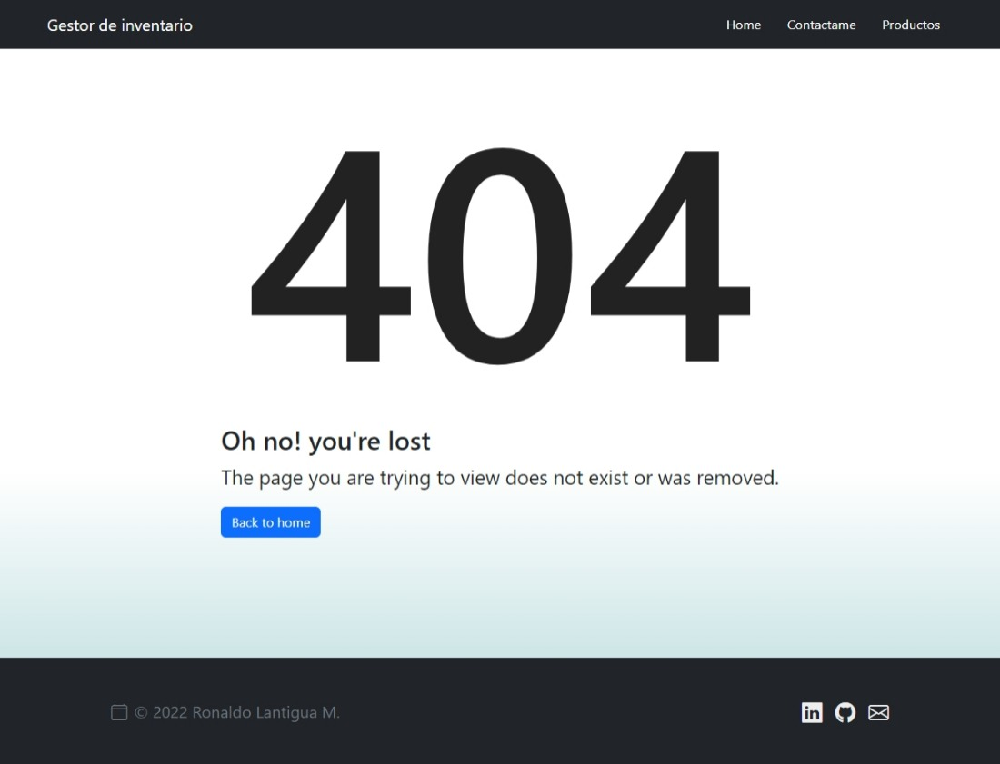

# Inventary managment

This app is based on inventory management, it allows you to:

* add new product
* list all product
* search product by name and category
* view mor detail of espesific product
* edit products
* delete products

This app connect whith a API created on node and mongodb, if your have interes can find API here: [API inventary managment
](https://github.com/Ronaldo20198855/API-inventary-managment)

**App:**https://inventary-management.herokuapp.com/

----
## Captures

